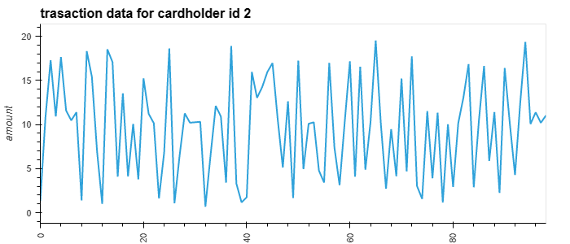
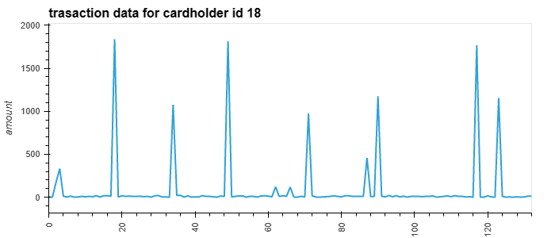
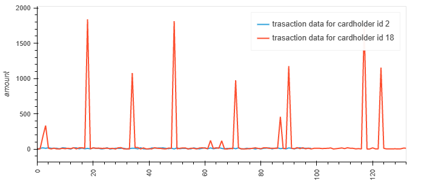
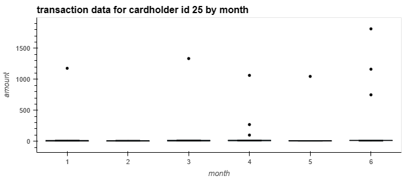

# Module-7-assignment (Markdown report)

## Part 1

**There are a total of 350 transactions which are below $2.00**. Hence, this is clear evidence that credit cards have been hacked, as this number is astonishingly high. 

However, it should be noted that when looking at transactions **between 7 am to 9 am for the year 2018**, there do not appear to be any fraudulent transactions in the top 100 transactions. 

But there is clear evidence that suggests that fraudulent transactions have been recorded during rest of the day.  

>The top 5 merchants that are prone to fraudulent trnasactions are: **Wood-Ramirez; Hood-Phillips; Baker Inc; Jarvis-Turner; and Martinez Group.**  

The views for all the queries have been prepared in the SQL file.

*Lastly, the schema file and query file for SQL both contain the queries used for data analysis. This is because queries were originally prepared in the schema file, but for submission purposes a query file has been created as well.* 

-----

## Part 2

### Data for card holder 2

>*As per the analysis, there definitely seems to be evidence of hacking for cardholder 2, as there are multiple transactions below $2.00 for cardholder 2*

### Data for cardholder 18
--------

>*In case of cardholder 18, there does not appear to be too many fraudulent transations, and the spending pattern is vastly different for this cardholder as well.* 

---------

### Comparison between cardholders 2 & 18

>*Here, in this line plot the spending patterns for cardholders 2 and 18 are compared, and it is clear that their spending patterns are significantly different. And this difference clearly shows that cardholder 2 has had their credit card hacked way more than cardholder 18.*  

-------

### Data for Cardholder 25

>*In case of cardholder 25, the data has been analysed on a monthly basis from January to June 2018 on a box plot. It should be noted that this cardholder's average spending pattern is transactions below $50 for each month. However, there are outliers within these transactions, which are quite high in comparison to the average spending pattern for this cardholder. These outliers have been recorded in each month from January to June 2018, except February. And the frequency of these outliers is in the range of 1-3 outlying transactions per month. Moreover, because of how vast these outlying transactions are, it is recommended that this box plot be referred to again in jupyter notebook (Python), in order to carry out futher inspection of monthly average spending patterns for cardholder 25.*    

